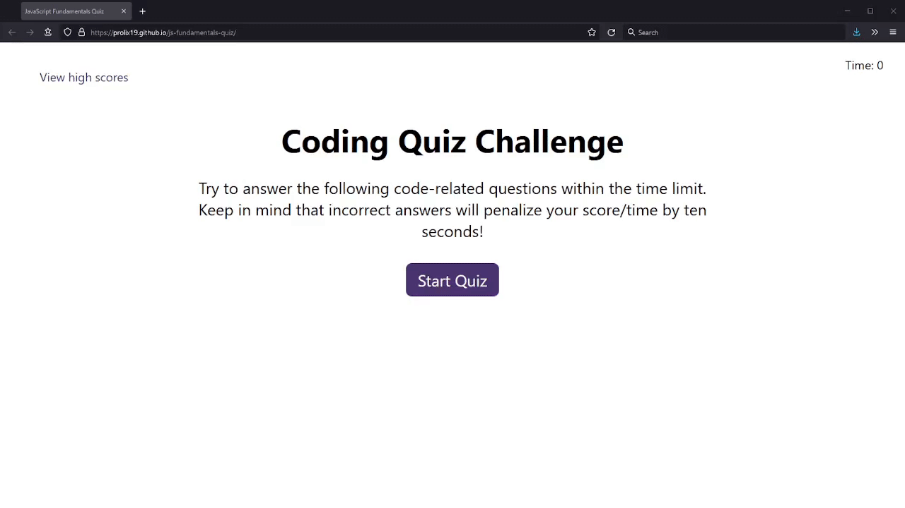

# JavaScript Fundamentals Quiz

## Description

A timed coding quiz related to JavaScipt with multiple-choice questions.

### Website Link:

[https://prolix19.github.io/js-fundamentals-quiz/](https://prolix19.github.io/js-fundamentals-quiz/)

### The Story:

This quiz was created to meet the requirements of the following user story:

```
AS A coding boot camp student
I WANT to take a timed quiz on JavaScript fundamentals that stores high scores
SO THAT I can gauge my progress compared to my peers
```

### Screenshot of the Quiz:



### For Further Details:

Please check the repository's commit history and associated comments to see more information about this coding quiz.